## 平台简介
一套基于Oozie调度引擎开发的大数据任务可视化编辑、运行与监控的调度管理平台，同时扩展了Oozie Action组件(支持更多丰富的action操作，如：jdbc、impala、elasticsearch、数据清洗、压缩、解压等等)。平台具备完善的权限管理和数据权限。


## 技术栈
1. SpringBoot框架
2. Shiro安全控制
3. Thymeleaf模板
4. Bootstrap 3.3.6前端框架
5. Dubbo分布式
6. Quartz定时服务
7. Hadoop（Hdfs、Yarn、Oozie、Hive、Spark、MapReduce、Sqoop ... ）
8. Kerberos大数据安全认证


## 内置功能
1.  用户管理：用户是系统操作者，该功能主要完成系统用户配置。
2.  部门管理：配置系统组织机构（公司、部门、小组），树结构展现支持数据权限。
3.  岗位管理：配置系统用户所属担任职务。
4.  菜单管理：配置系统菜单，操作权限，按钮权限标识等。
5.  角色管理：角色菜单权限分配、设置角色按机构进行数据范围权限划分。
6.  字典管理：对系统中经常使用的一些较为固定的数据进行维护。
7.  参数管理：对系统动态配置常用参数。
8.  通知公告：系统通知公告信息发布维护。
9.  操作日志：系统正常操作日志记录和查询；系统异常信息日志记录和查询。
10. 登录日志：系统登录日志记录查询包含登录异常。
11. 在线用户：当前系统中活跃用户状态监控。
12. 策略通道：在线（添加、修改、删除)调度策略的执行计划。
13. 代码生成：前后端代码的生成（java、html、xml、sql)支持CRUD下载 。
14. 系统接口：根据业务代码自动生成相关的api接口文档。
15. 服务监控：监视当前系统CPU、内存、磁盘、堆栈等相关信息。
16. 在线构建器：拖动表单元素生成相应的HTML代码。
17. 连接池监视：监视当前系统数据库连接池状态，可进行分析SQL找出系统性能瓶颈。
18. 集群注册：根据具体的Hadoop集群环境配置相应参数。比如：Hdfs、HA、Yarn、Oozie等必要参数。
19. 租户注册：对指定集群环境配置租户信息。
20. 项目管理：针对大数据平台实施具体项目工程，进行作业信息隔离的凭证。
21. 项目包：开发具体作业所使用的普通包、模板包等，完成对oozie workflow的可视化操作。
22. 作业维护：具体运行的作业任务，支持对任务的定时、依赖等策略的设置。对应于oozie的coordinator。
23. 作业日志：对任务的可视化监控和日志查看。

## 目录结构
```
atomic-parent:
   ├─atomic-admin               `(系统管理模块web)`
   ├─atomic-common              `(业务核心模块)`
   ├─atomic-dubbo-api           `(dubbo api模块)`
   ├─atomic-framework           `(核心基础框架)`
   ├─atomic-generator           `(自动代码生成器模块)`
   ├─atomic-module              `(多功能模块)`
     ├─atomic-hadoop-common     `(hadoop基础功能包)`
     ├─atomic-oozie             `(oozie功能模块)`
     ├─atomic-tenant            `(租户中心)`
   ├─atomic-scheduler           `(调度策略模块)`
   ├─atomic-system              `(后台管理模块)`
   ├─doc                        `(文档)`
```


## 体验
> admin/admin123  
> 

## 测试环境部署
一、 大数据环境准备
1. Cloudera官网下载QuickStarts for CDH镜像,地址：https://www.cloudera.com/downloads/quickstart_vms/5-13.html。如图所示：
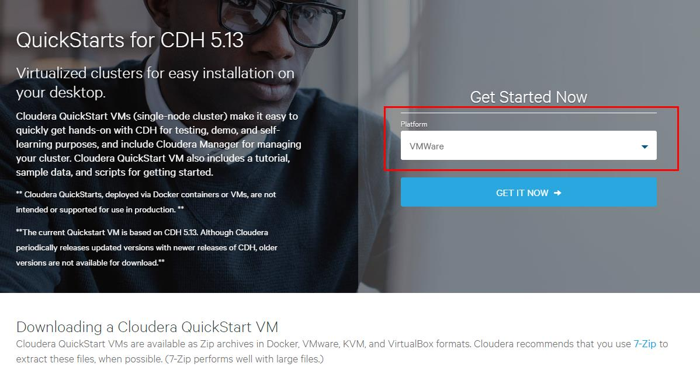

2. 启动虚拟机后，先调整时区及时间：
```
 > cp /usr/share/zoneinfo/Asia/Shanghai /etc/localtime -R
 > 其他省略
```

3. 创建在centos主机上创建atomic用户和组，且ID大于1000。
```
 - groupadd -g 1010 atomic
 - useradd -u 1010 -g 1010 -d /home/atomic  atomic 
```

4. 开启kerberos认证
```
 在centos桌面点击：【Configure Kerberos】图标，进行kerberos安装配置（确保网络正常）。
 安装好后kadmin的账号(密码)：cloudera/admin(cloudera)
```
5. 开启CM服务
```
 点击桌面【Launch Cloudera Express】图标，等待完成后，执行如下命令：
 > chkconfig mysqld off
 > chkconfig krb5kdc off
 > chkconfig kadmin off
 > chkconfig cloudera-scm-server off
 > chkconfig cloudera-scm-agent off
 > 重启机器，开机后行执行如下命令：
 > service mysqld start
 > service krb5kdc start
 > service kadmin start
 > service cloudera-scm-server start
 > service cloudera-scm-agent start
 > 在CM界面中开启keberos认证...
```
6. 登录CM（账号密码:admin/admin 或者 cloudera/cloudera），关闭和删除不需要的服务组件，处理报警信息。确保HDFS、Yarn、Oozie正常开启。
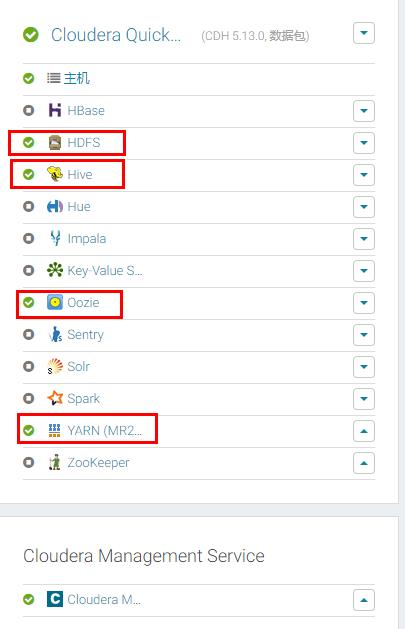

7. 分别对HDFS和Oozie增加代理租户和时区配置
```
HDFS增加配置：
<property>
    <name>hadoop.proxyuser.atomic.hosts</name>
    <value>*</value>
</property>
<property>
    <name>hadoop.proxyuser.atomic.groups</name>
    <value>*</value>
</property>

Oozie增加配置：
<property>
    <name>oozie.processing.timezone</name>
    <value>GMT+0800</value>
</property>
<property>
    <name>oozie.service.ProxyUserService.proxyuser.oozie.hosts</name>
    <value>*</value>
</property>
<property>
    <name>oozie.service.ProxyUserService.proxyuser.oozie.groups</name>
    <value>*</value>
</property>
<property>
    <name>oozie.service.ProxyUserService.proxyuser.atomic.hosts</name>
    <value>*</value>
</property>
<property>
    <name>oozie.service.ProxyUserService.proxyuser.atomic.groups</name>
    <value>*</value>
</property>
<property>
    <name>oozie.use.system.libpath</name>
    <value>*</value>
</property>
<property>
    <name>oozie.action.max.output.data</name>
    <value>204800</value>
</property>
<property>
    <name>oozie.action.launcher.mapreduce.job.ubertask.enable</name>
    <value>true</value>
</property>
<property>
    <name>oozie.authentication.kerberos.principal</name>
    <value>*</value>
</property>
```

8. 为租户atomic生成keytab文件
```
 > kadmin.local -q "addprinc -randkey atomic"
 > kadmin.local -q "xst -k /root/atomic.keytab atomic@CLOUDERA"

```

9. 为Oozie Server增加监听配置和扩展Action组件(暂不开放)
10. 在部署web服务的主机上配置hosts主机映射

二、Atomic服务部署与配置
1. 执行doc/sql下的atomic.sql、quartz.sql脚本，在Oozie server的Mysql ooize库中执行oozie.sql
2. 修改application-local.yml中的数据库信息，master是web服务所用的mysql数据库，slave为oozie server的mysql数据库信息。
3. 通过idea启动web服务AtomicApplication
4. 启动成功后，注册hadoop集群配置信息，如图所示：
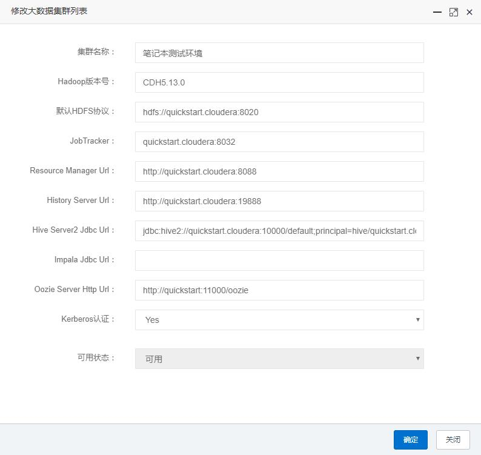
5. 对集群增加高级配置（包含：代理租户、HA、Kerberos认证）：
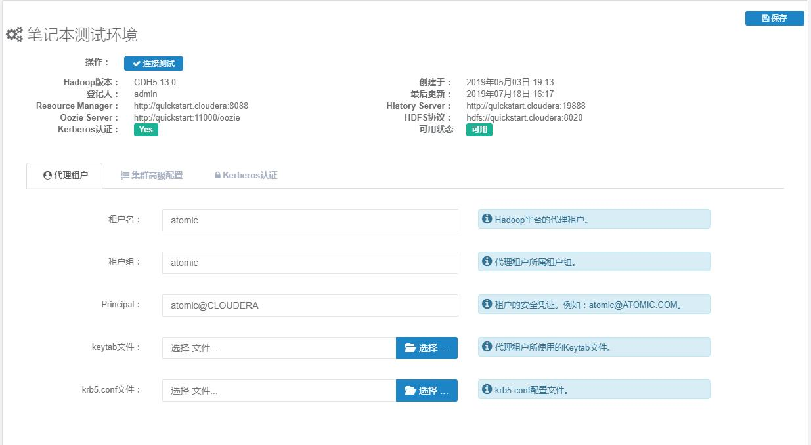
6. 为指定集群增加租户配置信息
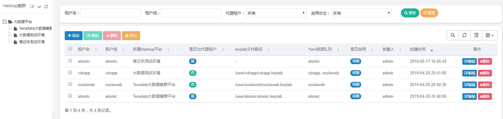
7. 配置任务包
8. 作业注册
9. 编辑作业运行参数(时间、策略、依赖、运行参数等等)
10. 运行作业
11. 监控并查看日志

演示地址：

文档地址：

## 演示图

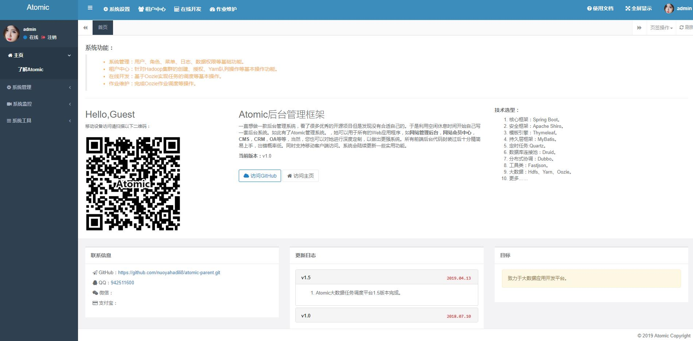
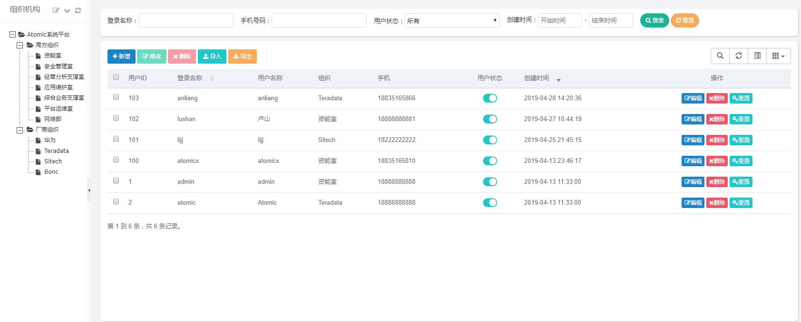
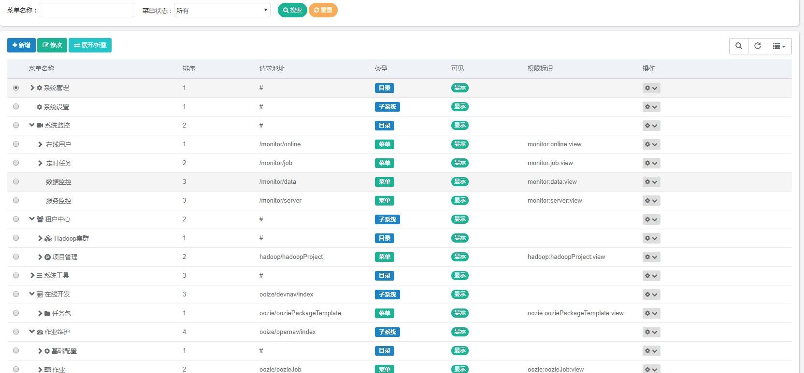
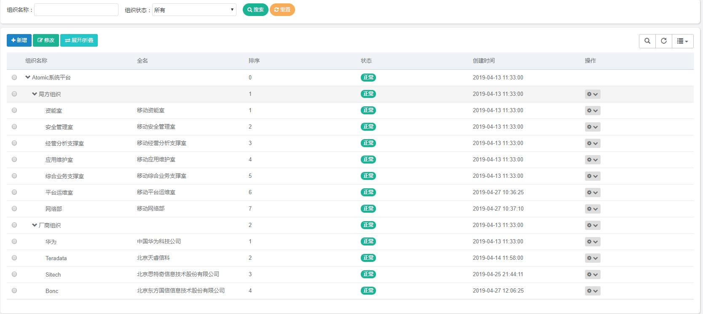

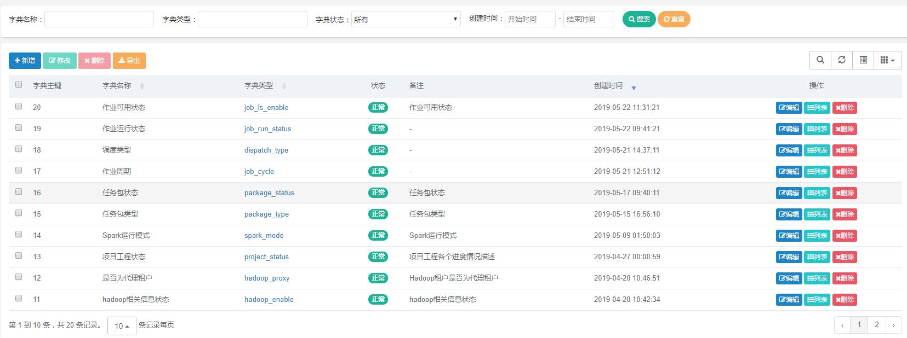
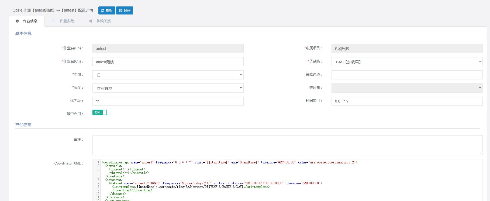

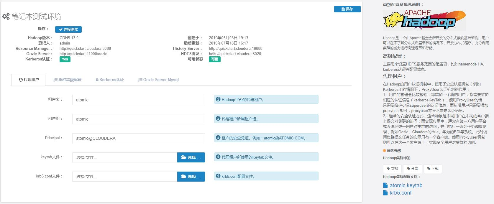
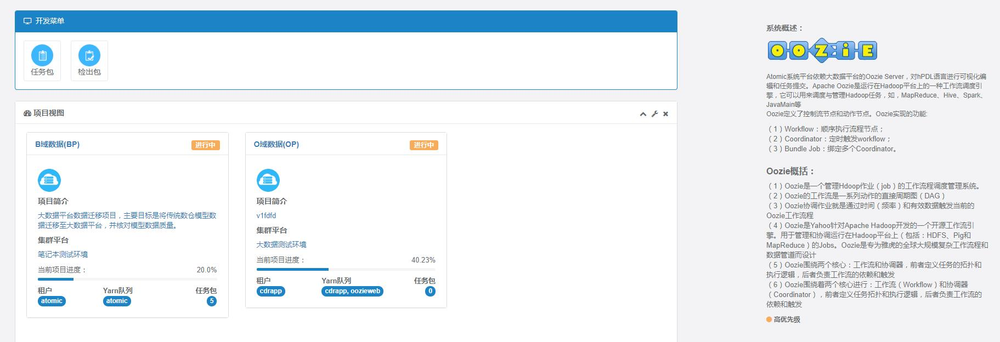
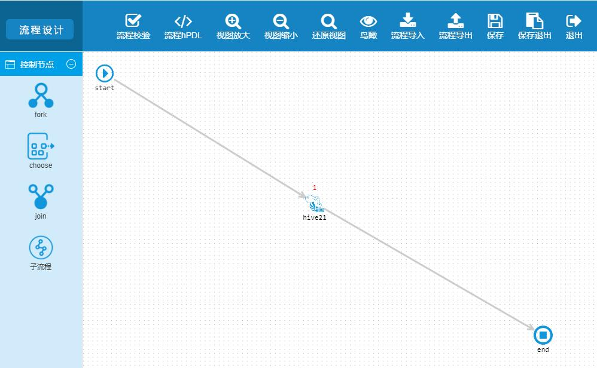
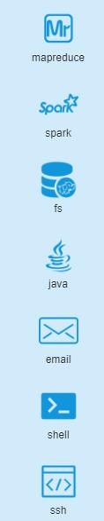
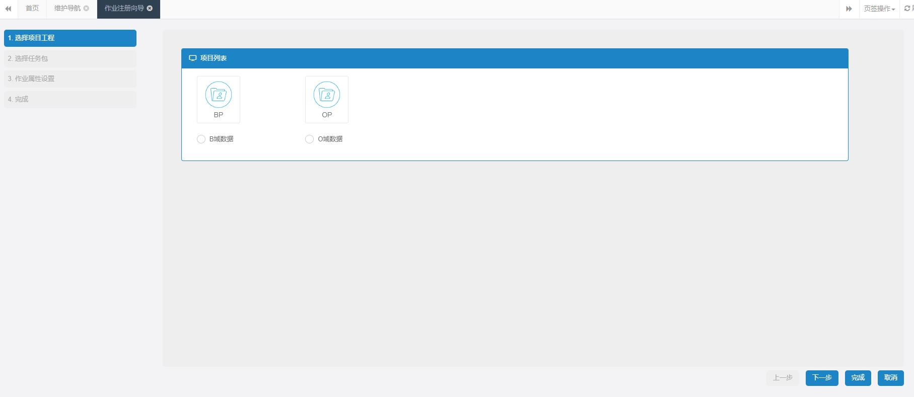
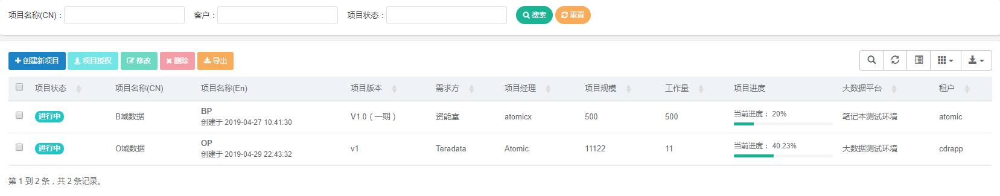
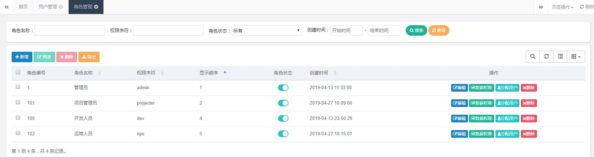

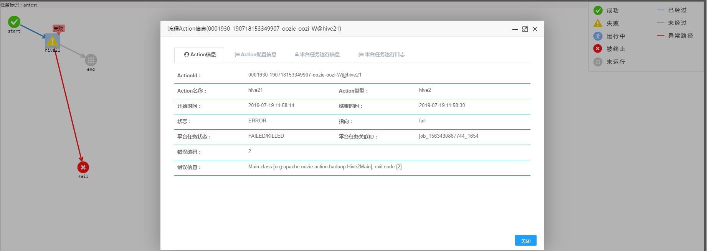

## Atomic交流群
QQ：683706330

## 开源不易
| 微信 | 支付宝 |
| ---- | ---- |
| | |


